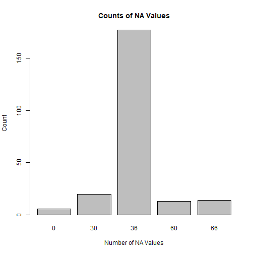

```r
# # Define a vector of package names to check for and install if needed
# packages <- c("wbstats", "dplyr", "reshape", "tidyr", "countrycode", "tidyverse", "ggplot2", "expss", "writexl", "readxl", "imputeTS")
# 
# # Loop over each package and check if it's installed
# for (package in packages) {
#   if (!require(package)) {
#     install.packages(package)
#   }
# }
```

```r
library(wbstats)
library(dplyr)
library(reshape)
library(tidyr)
library(countrycode)
library(tidyverse)
library(ggplot2)
library(expss)
library(writexl)
library(readxl)
library(imputeTS)
library(tidyverse)
library(naniar)
library(ggplot2)
library(visdat)
library(lubridate)
library(zoo)


# library(stringr)
# library(imputeTS)
# library(foreach)
# library(data.table)
# library(naniar)
```

# Introduction
# Data
# Methods


```r
# Loading WB data from web
# useful links:
# https://github.com/gshs-ornl/wbstats
# https://joenoonan.se/post/country-code-tutorial/


# Using data from 2017 onwards because that seems to avoid a lot of issues around missing values on the economic indicators.
```

```r
# world_bank <- wb_data(country = "countries_only",
#                       indicator = c("SP.POP.TOTL", "SH.STA.SUIC.P5" , "SH.STA.SUIC.FE.P5" , "SH.STA.SUIC.MA.P5" , "SE.COM.DURS" , "NY.GDP.PCAP.KD" , "SL.UEM.1524.ZS" , "SL.UEM.1524.MA.ZS" , "SL.UEM.1524.FE.ZS" , "SL.UEM.TOTL.ZS" , "SL.UEM.TOTL.MA.ZS" , "SL.UEM.TOTL.FE.ZS"),
#                       mrv = 10,
#                       gapfill = TRUE) # this automatically does interpolation!
#%>% 
 # filter(date >= 2017)

# Saving to Excel because I've had issues accessing the World Bank server
# write_xlsx(world_bank,"../data/world_bank.xlsx")

world_bank <- read_excel("../data/world_bank.xlsx", na = "")


# Changing variable names
```

```r
varnames <- c("iso2c", "iso3c", "country", "year", "gdp_pc", "edu", "sui_female", "sui_male", "sui", "unem_y_female", "unem_y_male", "unem_y", "unem_t_female", "unem_t_male", "unem_t", "pop_t")
colnames(world_bank) <- varnames
```

World Bank data to long


```r
tmp_wb_long <- world_bank %>%
  pivot_longer(cols = !c(country, iso3c, iso2c, year),
               names_to = "indicator",
               values_to = "value"
               )

tmp_wb_long[tmp_wb_long == 'NULL'] <- NA

# Creating gender column in WB data
```

```r
tmp_wb_long <- tmp_wb_long %>%
  mutate(sex = case_when(
    str_detect(indicator, "female") ~ "Female",
    str_detect(indicator, "male") ~ "Male"),
    sex = ifelse(is.na(sex), "Both", sex))

# Remove "male" and "female" from indicator descriptions
```

```r
tmp_wb_long$indicator <- gsub("_male","",as.character(tmp_wb_long$indicator))
tmp_wb_long$indicator <- gsub("_female","",as.character(tmp_wb_long$indicator))

# dropping ISO2C column; pretty sure there's an easier way.
```

```r
tmp_wb_long <- subset(tmp_wb_long, select = -c(iso2c))
```

# GBD dataset ###


```r
# Loading GBD data

gbd <- read.csv("../data/gbd/gbd_clean.csv", header = TRUE, sep = ",", na.strings = NA)


# Dropping columns we don't need
gbd <- gbd[, -c(1, 2, 3, 5, 7, 8, 9, 11, 12, 15, 16)]


# insert column with country codes
```

```r
# converting country names to world bank destination coding scheme using countrycode library. target var is ISO3C

gbd <- gbd %>%
  mutate(iso3c = countrycode(location_name,"country.name", "wb"))
```

```
## Warning: There was 1 warning in `mutate()`.
## ℹ In argument: `iso3c = countrycode(location_name, "country.name", "wb")`.
## Caused by warning in `countrycode_convert()`:
## ! Some values were not matched unambiguously: Cook Islands, Niue, Tokelau, Turkiye
```

```r
# Warning message:
#   There was 1 warning in `mutate()`.
# b9 In argument: `ISO3C = countrycode(location_name, "country.name", "wb")`.
# Caused by warning in `countrycode_convert()`:
#   ! Some values were not matched unambiguously: Cook Islands, Niue, Tokelau, Turkiye 

# Manually adding ISO country code for these:
gbd$iso3c[gbd$location_name == "Cook Islands"] <- "COK"
gbd$iso3c[gbd$location_name == "Niue"] <- "NIU"
gbd$iso3c[gbd$location_name == "Tokelau"] <- "TKL"
gbd$iso3c[gbd$location_name == "Turkiye"] <- "TUR"

#check to see if there are any cases missing in ISO3C
filter(gbd, is.na(iso3c))
```

```
## [1] location_name sex_name      cause_name    year          val           iso3c        
## <0 rows> (or 0-length row.names)
```

```r
# is now complete


# Drop data before 2017 (although this is a shame)
#gbd <- gbd[gbd$year <= 2017, ]

# Dropping rows relating to sexual voilence because thta appears to be zero throughout.
gbd <- gbd[gbd$cause_name != "Sexual violence", ] 


# Renaming columns
```

```r
tmp_gbd_oldnames <- colnames(gbd)
tmp_gbd_oldnames
```

```
## [1] "location_name" "sex_name"      "cause_name"    "year"          "val"           "iso3c"
```

```r
tmp_gbd_newnames <- c("country", "sex", "indicator", "year", "value", "iso3c" )
colnames(gbd) <- tmp_gbd_newnames
```

MERGING DATASETS and Adding in continent:


```r
tmp_wb_gbd_long <- rbind(tmp_wb_long, gbd)
tmp_wb_gbd_long[tmp_wb_gbd_long == 'NULL'] <- NA


tmp_wb_gbd_wide <- tmp_wb_gbd_long %>%
  pivot_wider(names_from = "indicator",
               values_from = "value"
  )

continent <- read.csv("../data/continents.csv") 
tmp_wb_gbd_wide <- left_join(tmp_wb_gbd_wide, continent, by = "iso3c")
```

Checking country names for combined dataset as some variance in spelling was found:


```r
tmp_countries_wb_gbd <- as.list(unique(tmp_wb_gbd_wide[c("country")]))
tmp_countries_wb_gbd <- lapply(tmp_countries_wb_gbd, sort, decreasing = FALSE)
tmp_countries_wb_gbd <- as.data.frame(tmp_countries_wb_gbd)

write_xlsx(tmp_countries_wb_gbd, "../outputs/countries_combined.xlsx")
```


```r
# The following were changed manually in the gbd dataset to reflect spelling in the wb dataset:

# Bahamas
# Bahamas, The
#
# Bolivia
# Bolivia (Plurinational State of)
# 
# Congo
# Congo, Dem. Rep.
# Congo, Rep.
# Democratic Republic of the Congo
# 
# Cote d'Ivoire
# CC4te d'Ivoire
# 
#
# Egypt
# Egypt, Arab Rep.
#
# Gambia
# Gambia, The
#
# Iran (Islamic Republic of)
# Iran, Islamic Rep.
#
# Kyrgyz Republic
# Kyrgyzstan
# 
# Lao PDR
# Lao People's Democratic Republic
# 
# Micronesia (Federated States of)
# Micronesia, Fed. Sts.
#
# Slovak Republic
# Slovakia
#
# Turkey
# Turkiye
#
# United States
# United States of America
#
# Venezuela (Bolivarian Republic of)
# Venezuela, RB
# 
# Viet nam
# Vietnam
#
# Yemen
# Yemen, Rep.


# Getting summary of wide dataset
```

```r
summary(tmp_wb_gbd_wide)
```

```
##     iso3c             country               year          sex                gdp_pc            edu              sui         
##  Length:14166       Length:14166       Min.   :2000   Length:14166       Min.   :   261   Min.   : 0.000   Min.   :  0.000  
##  Class :character   Class :character   1st Qu.:2005   Class :character   1st Qu.:  2201   1st Qu.: 9.000   1st Qu.:  3.700  
##  Mode  :character   Mode  :character   Median :2011   Mode  :character   Median :  6195   Median :10.000   Median :  6.900  
##                                        Mean   :2011                      Mean   : 16575   Mean   : 9.895   Mean   :  9.942  
##                                        3rd Qu.:2016                      3rd Qu.: 19843   3rd Qu.:12.000   3rd Qu.: 12.200  
##                                        Max.   :2021                      Max.   :204190   Max.   :17.000   Max.   :147.800  
##                                                                          NA's   :12067    NA's   :12210    NA's   :8676     
##      unem_y           unem_t           pop_t           Alcohol use disorders Drug use disorders Depressive disorders
##  Min.   : 0.194   Min.   : 0.050   Min.   :1.044e+04   Min.   :  52.31       Min.   : 68.72     Min.   : 1034       
##  1st Qu.: 8.062   1st Qu.: 3.740   1st Qu.:7.521e+05   1st Qu.: 281.57       1st Qu.:144.63     1st Qu.: 2663       
##  Median :14.712   Median : 6.110   Median :6.220e+06   Median : 563.85       Median :194.31     Median : 3635       
##  Mean   :18.092   Mean   : 8.189   Mean   :3.458e+07   Mean   : 743.78       Mean   :207.34     Mean   : 3874       
##  3rd Qu.:24.653   3rd Qu.:11.051   3rd Qu.:2.336e+07   3rd Qu.:1089.44       3rd Qu.:249.96     3rd Qu.: 4770       
##  Max.   :80.762   Max.   :42.551   Max.   :1.412e+09   Max.   :3678.89       Max.   :618.78     Max.   :11304       
##  NA's   :8556     NA's   :8556     NA's   :11996       NA's   :1926          NA's   :1926       NA's   :1926        
##    Self-harm        continent          sub_region       
##  Min.   :  6.791   Length:14166       Length:14166      
##  1st Qu.: 23.819   Class :character   Class :character  
##  Median : 40.020   Mode  :character   Mode  :character  
##  Mean   : 60.645                                        
##  3rd Qu.: 84.176                                        
##  Max.   :883.830                                        
##  NA's   :1926
```

```r
# renaming vars so all are in line

varnames_old <- colnames(tmp_wb_gbd_wide)
varnames_old
```

```
##  [1] "iso3c"                 "country"               "year"                  "sex"                   "gdp_pc"               
##  [6] "edu"                   "sui"                   "unem_y"                "unem_t"                "pop_t"                
## [11] "Alcohol use disorders" "Drug use disorders"    "Depressive disorders"  "Self-harm"             "continent"            
## [16] "sub_region"
```

```r
varnames_new <- c("iso3c", "country", "year","sex","gdp_pc","edu","sui","unem_y","unem_t","pop_t","alc", "drug","depr","sh", "continent", "region")
colnames(tmp_wb_gbd_wide) <- varnames_new
```

# Imputation


```r
# Considerations for imputation:
# - GDP, GDP / capita, compulsory education, total population: same value for male / female as overall. Can use na_mean from imputeTS package.
# - Then, for all vars: Missing years --> interpolation
# 
```

```r
## Prepare second data set
tmp_wb_gbd_wide.both <- tmp_wb_gbd_wide %>% 
  filter(sex == "Both") %>% 
  select(!sex)

## Join the two data sets because you have to make sure that contry and year
## are correctly merged. 
tmp_wb_gbd_wide.tmp2 <- 
  left_join(x = tmp_wb_gbd_wide, y = tmp_wb_gbd_wide.both, 
            by = c("country", "year"),
            suffix = c("", ".y"))


### finally got this working, I'm sure there is a more elegant way of doing this.
# NEed to explicitly include plyr here, otherwise get an error.
tmp_wb_gbd_wide <- tmp_wb_gbd_wide.tmp2 %>% 
  plyr::mutate(sui = coalesce(sui, sui.y),
         gdp_pc = coalesce(gdp_pc, gdp_pc.y), 
         edu = coalesce(edu, edu.y), 
         pop_t = coalesce(pop_t, pop_t.y))
         
         
# remove columns with .y suffix

columns_to_remove <- grep("\\.y", names(tmp_wb_gbd_wide))
tmp_wb_gbd_wide <- tmp_wb_gbd_wide[,-columns_to_remove]


# list of countries
tmp_countries_wb_gbd <- as.list(unique(tmp_wb_gbd_wide[c("country")]))

length(tmp_countries_wb_gbd[[1]])
```

```
## [1] 230
```

```r
# we have 230 countries
```

Exploring missing values


```r
# Counting missing values by country

tmp_na_count <- tmp_wb_gbd_wide %>%
  group_by(country) %>%
  dplyr::summarize(count_na = sum(is.na(sui)))

# count the occurrences of each value in count_na[2]
tmp_counts <- table(tmp_na_count$count_na)
# print(tmp_counts)

# create a bar plot of the counts
barplot(tmp_counts, xlab = "Number of NA Values", ylab = "Count", main = "Counts of NA Values")
```



Countries that are missing 30 all instances


```r
# Which countries are missing missing?
# subset na_count to include only rows where count_na[2] is 15
tmp_subset30 <- tmp_na_count[tmp_na_count$count_na == 30, ]

# print the values of count_na[1] in the subset
print(tmp_subset30)
```

```
## # A tibble: 20 × 2
##    country                   count_na
##    <chr>                        <int>
##  1 Aruba                           30
##  2 British Virgin Islands          30
##  3 Cayman Islands                  30
##  4 Channel Islands                 30
##  5 Curacao                         30
##  6 Faroe Islands                   30
##  7 French Polynesia                30
##  8 Gibraltar                       30
##  9 Hong Kong SAR, China            30
## 10 Isle of Man                     30
## 11 Kosovo                          30
## 12 Liechtenstein                   30
## 13 Macao SAR, China                30
## 14 New Caledonia                   30
## 15 Sint Maarten (Dutch part)       30
## 16 St. Kitts and Nevis             30
## 17 St. Martin (French part)        30
## 18 Turks and Caicos Islands        30
## 19 Virgin Islands (U.S.)           30
## 20 West Bank and Gaza              30
```

Countries that are missing 9 values (only have 9 lines because they only occur in the GDB dataset)


```r
# Which countries are missing 9 values?
# subset na_count to include only rows where count_na[2] is 15
tmp_subset9 <- tmp_na_count[tmp_na_count$count_na == 9, ]

# print the values of count_na[1] in the subset
print(tmp_subset9, n=50)
```

```
## # A tibble: 0 × 2
## # … with 2 variables: country <chr>, count_na <int>
```

remove countries with no data on suicide rates


```r
# create a vector of values to exclude
tmp_exclude_vec <- as.character(c(tmp_subset30[[1]], tmp_subset9[[1]]))
tmp_exclude_vec
```

```
##  [1] "Aruba"                     "British Virgin Islands"    "Cayman Islands"            "Channel Islands"          
##  [5] "Curacao"                   "Faroe Islands"             "French Polynesia"          "Gibraltar"                
##  [9] "Hong Kong SAR, China"      "Isle of Man"               "Kosovo"                    "Liechtenstein"            
## [13] "Macao SAR, China"          "New Caledonia"             "Sint Maarten (Dutch part)" "St. Kitts and Nevis"      
## [17] "St. Martin (French part)"  "Turks and Caicos Islands"  "Virgin Islands (U.S.)"     "West Bank and Gaza"
```

```r
# subset the data frame to exclude rows where the value in the column is in the exclude_vec
tmp_wb_gbd_wide <- subset(tmp_wb_gbd_wide, !country %in% tmp_exclude_vec)

tmp_test_countries <- as.list(unique(tmp_wb_gbd_wide[c("country")]))
length(tmp_test_countries[[1]])
```

```
## [1] 210
```

```r
# we have 183 countries
```

# Replacing missing values


```r
# getting a plot with a pattern of missing data.
# Note: I used this plot to go back upstream in my code and improve the result by removing countries with missing data on the suicide variable.
```

```r
# Group the data by country
tmp_df_by_country <- tmp_wb_gbd_wide %>%
  group_by(country, sex) %>%
  arrange(year)

# Create a heatmap of missing data using vis_miss()
vis_miss(tmp_df_by_country)
```

```
## Warning: Raster pixels are placed at uneven horizontal intervals and will be shifted
## ℹ Consider using `geom_tile()` instead.
```


```r
###############################################################################
# TRY AND FIX THIS BIT
###############################################################################

# 
# # # A Table showing the number of missings per column by country, only for those with missing data.
# library(dplyr)
# 
# # This was working yesterday...
# # Group by country and summarize missing values in each column
# df_miss <- df_by_country %>%
#   group_by(country) %>%
#   summarize_at(vars(-group_cols()), ~sum(is.na(.)))
# 
# # Filter only those with missing values
# df_miss_filtered <- df_miss %>%
#   filter(rowSums(df_miss[, -1]) > 0)
# 
# # View the result
# print(df_miss_filtered, n=250)
# 
# 
# library(pheatmap)
# 
# # Transpose the data frame so that variables are columns and countries are rows
# df_miss_transposed <- t(df_miss_filtered[, -1])
# 
# # Create a heatmap with pheatmap
# pdf("../outputs/heatmap_missings.pdf")
# 
# pheatmap(df_miss_transposed, 
#          color = colorRampPalette(c("yellow", "purple"))(100), 
#          cluster_cols = TRUE)
# dev.off()


# The heatmap shows the pattern of missing values across the variables and countries. Each row in the heatmap corresponds to a variable, and each column corresponds to a country. The cells in the heatmap are colored according to the proportion of missing values for that variable in that country, with white cells indicating no missing values, and blue cells indicating high proportions of missing values.
# 
# Interpreting the heatmap involves looking for patterns in the missing data across the different variables and countries. Here are some general guidelines:
#   
#   Look for variables that have a high proportion of missing values across many countries. These variables may be difficult to work with, as they may limit the scope of analysis or introduce bias.
#   Look for countries that have a high proportion of missing values across many variables. These countries may be underrepresented in the analysis or may require imputation methods to handle the missing data.
#   Look for patterns of missingness that may be related to other variables or factors. For example, if a country has a high proportion of missing values for income and education variables, it may be an indication of socioeconomic disparities or differences in data collection methods.
# In general, interpreting missing data can be complex and may require additional information about the variables and countries in question. The heatmap can provide a useful visual summary of the missing data patterns, but it should be used in conjunction with other analyses and considerations.


###############################################################################
###############################################################################
```

Replace where it's missing in the series.


```r
# https://stackoverflow.com/questions/50648800/ggplot-plotting-timeseries-data-with-missing-values
# na_locf() from package zoo
```

# Impute missing values using median by group (country, sex). There may be a more efficient way of doing this


```r
tmp_wb_gbd_wide %>% is.na() %>% colSums()
```

```
##     iso3c   country      year       sex    gdp_pc       edu       sui    unem_y    unem_t     pop_t       alc      drug      depr 
##         0         0         0         0      7722      8100      8076      8166      8166      7656      1326      1326      1326 
##        sh continent    region 
##      1326         0         0
```

```r
tmp_df_imputed <- tmp_wb_gbd_wide %>%
  group_by(country, year) %>%
  mutate_if(is.numeric, na.aggregate, FUN = median) %>%
  ungroup()
```

```
## `mutate_if()` ignored the following grouping variables:
## • Columns `country`, `year`
```

```r
tmp_df_imputed %>% is.na() %>% colSums()
```

```
##     iso3c   country      year       sex    gdp_pc       edu       sui    unem_y    unem_t     pop_t       alc      drug      depr 
##         0         0         0         0      7722      8100      8076      8166      8166      7656      1326      1326      1326 
##        sh continent    region 
##      1326         0         0
```

```r
# And by country only

tmp_df_imputed2 <- tmp_df_imputed %>%
  group_by(country) %>%
  mutate_if(is.numeric, na.aggregate, FUN = median) %>%
  ungroup()
```

```
## `mutate_if()` ignored the following grouping variables:
## • Column `country`
```

```r
tmp_df_imputed2 %>% is.na() %>% colSums()
```

```
##     iso3c   country      year       sex    gdp_pc       edu       sui    unem_y    unem_t     pop_t       alc      drug      depr 
##         0         0         0         0       876      1638      1704      1902      1902       780       180       180       180 
##        sh continent    region 
##       180         0         0
```

```r
# This approach isn't that successful for some vars --> imputing median by region
# Repeating imputation by region Obviously not the correct thing to do!

tmp_df_imputed3 <- tmp_df_imputed2 %>%
  group_by(region) %>%
  mutate_if(is.numeric, na.aggregate, FUN = median) %>%
  ungroup()
```

```
## `mutate_if()` ignored the following grouping variables:
## • Column `region`
```

```r
tmp_df_imputed3 %>% is.na() %>% colSums()
```

```
##     iso3c   country      year       sex    gdp_pc       edu       sui    unem_y    unem_t     pop_t       alc      drug      depr 
##         0         0         0         0         0       264         0         0         0         0         0         0         0 
##        sh continent    region 
##         0         0         0
```

```r
# And finally by continent

tmp_df_imputed4 <- tmp_df_imputed3 %>%
  group_by(continent) %>%
  mutate_if(is.numeric, na.aggregate, FUN = median) %>%
  ungroup()
```

```
## `mutate_if()` ignored the following grouping variables:
## • Column `continent`
```

```r
tmp_df_imputed4 %>% is.na() %>% colSums()
```

```
##     iso3c   country      year       sex    gdp_pc       edu       sui    unem_y    unem_t     pop_t       alc      drug      depr 
##         0         0         0         0         0         0         0         0         0         0         0         0         0 
##        sh continent    region 
##         0         0         0
```

Saving final dataset in wide format


```r
suicide_final <- tmp_df_imputed4


#write_xlsx(df_imputed3,"../data/suicide_final.xlsx")
```

Final preparations


```r
# Set year variable to date type to allow for time series analysis

suicide_final$year1 <- ymd(paste0(suicide_final$year, "-01-01"))
str(suicide_final$year1)
```

```
##  Date[1:13566], format: "2012-01-01" "2012-01-01" "2012-01-01" "2013-01-01" "2013-01-01" "2013-01-01" "2014-01-01" "2014-01-01" "2014-01-01" ...
```

```r
# Adding calculated column: total suicide deaths.
# Assuming population is 50/50 male / female, which is not true!
suicide_final <- suicide_final %>%
  mutate(deaths = case_when(
    sex %in% c("Male", "Female") ~ sui * pop_t * 0.5,
    TRUE ~ sui * pop_t
  ))
```

Generating long dataset


```r
indicators <- c("gdp_pc", "edu", "sui_female", "sui_male", "sui", "unem_y_female", "unem_y_male", "unem_y", "unem_t_female", "unem_t_male", "unem_t", "pop_t")

suicide_final_long <- suicide_final %>%
  pivot_longer(cols = c(5:14),
               names_to = "indicator",
               values_to = "value") 

# Labelling wide dataset
```


```r
suicide_final = apply_labels(suicide_final,
                             iso3c = "ISO3C",
                             country = "Country",
                             year = "Year",
                             gdp_pc = "GDP per capita (constant 2015 US$)",
                             edu = "Compulsory education, duration (years)",
                             sui = "Suicide mortality rate (per 100,000 population)",
                             unem_y = "Unemployment, youth total (% of total labor force ages 15-24) (modeled ILO estimate)" ,
                             unem_t = "Unemployment, total (% of total labor force) (modeled ILO estimate)",
                             pop_t = "Total population",
                             alc = "Alcohol abuse",
                             drug = "Drug abuse",
                             sh = "Self harm",
                             sex = "Sex",
                             depr = "Depression",
                             continent = "Continent",
                             region = "Sub-region",
                             deaths = "Deaths by suicide",
                             year1 = "Year in date format")
```

Removing temporary objects


```r
rm(list = ls()[grep("^tmp_", ls())])
```

