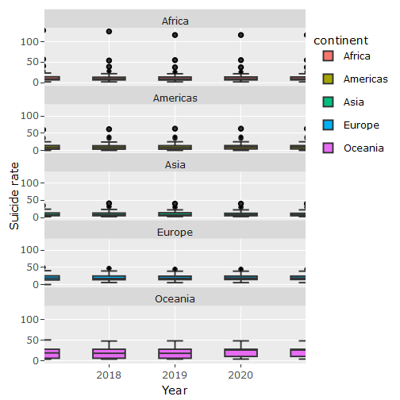
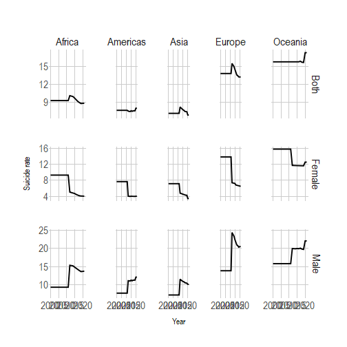
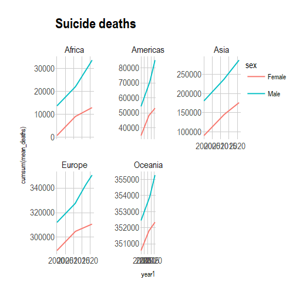
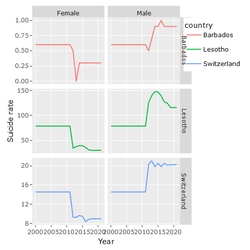
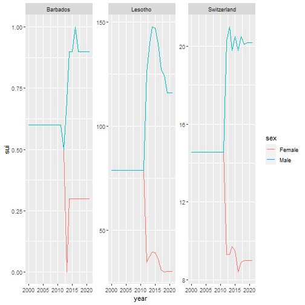

```r
library(BBmisc)
library(tidyverse)
library(table1)
library(hrbrthemes) # theme ipsom
library(ggplot2)
library(dplyr)
library(plotly)
library(webshot)


# Describe data set: summary
```

```r
summary(suicide_final)
```

```
##     iso3c             country               year          sex                gdp_pc            edu              sui             unem_y           unem_t           pop_t          
##  Length:13566       Length:13566       Min.   :2000   Length:13566       Min.   :   261   Min.   : 0.000   Min.   :  0.00   Min.   : 0.194   Min.   : 0.050   Min.   :1.044e+04  
##  Class1:labelled    Class1:labelled    1st Qu.:2005   Class1:labelled    1st Qu.:  2128   1st Qu.: 8.000   1st Qu.:  4.30   1st Qu.: 8.880   1st Qu.: 4.054   1st Qu.:1.436e+06  
##  Class2:character   Class2:character   Median :2011   Class2:character   Median :  6019   Median :10.000   Median :  7.30   Median :14.293   Median : 6.061   Median :8.053e+06  
##  Mode  :character   Mode  :character   Mean   :2011   Mode  :character   Mean   : 14128   Mean   : 9.704   Mean   : 10.15   Mean   :17.320   Mean   : 7.747   Mean   :3.794e+07  
##                                        3rd Qu.:2016                      3rd Qu.: 15600   3rd Qu.:11.000   3rd Qu.: 13.25   3rd Qu.:23.000   3rd Qu.: 9.562   3rd Qu.:2.720e+07  
##                                        Max.   :2021                      Max.   :204190   Max.   :17.000   Max.   :147.80   Max.   :80.762   Max.   :37.901   Max.   :1.412e+09  
##       alc               drug             depr             sh           continent            region              year1                deaths         
##  Min.   :  52.31   Min.   : 68.72   Min.   : 1034   Min.   :  6.791   Length:13566       Length:13566       Min.   :2000-01-01   Min.   :     0.00  
##  1st Qu.: 287.63   1st Qu.:144.79   1st Qu.: 2711   1st Qu.: 23.832   Class1:labelled    Class1:labelled    1st Qu.:2005-01-01   1st Qu.:    63.64  
##  Median : 576.05   Median :194.73   Median : 3642   Median : 39.908   Class2:character   Class2:character   Median :2011-01-01   Median :   354.89  
##  Mean   : 744.55   Mean   :207.38   Mean   : 3869   Mean   : 60.656   Mode  :character   Mode  :character   Mean   :2010-07-10   Mean   :  2453.53  
##  3rd Qu.:1087.74   3rd Qu.:248.73   3rd Qu.: 4747   3rd Qu.: 84.894                                         3rd Qu.:2016-01-01   3rd Qu.:  1163.88  
##  Max.   :3678.89   Max.   :618.78   Max.   :11304   Max.   :883.830                                         Max.   :2021-01-01   Max.   :182251.67
```

```r
# heatmap for 2021
```

```r
tmp_both <- suicide_final %>% filter(sex == "Both")

# table1 <- suicide_final %>% filter(sex == "Both") %>% table1(~ sui + deaths  + pop_t + edu + gdp_pc + unem_y + unem_t + 
#                                               alc + drug + depr + sh | ~ factor(continent))

table1 <- table1(~ sui + deaths + pop_t + edu + gdp_pc + unem_y + unem_t + alc + drug + depr + sh | factor(continent), data = tmp_both)


table1
```

```
##                                                                                                              Africa                   Americas                          Asia
## 1                                                                                                          (N=1196)                    (N=870)                      (N=1090)
## 2                                       Suicide mortality rate (per 100,000 population)                                                                                     
## 3                                                                             Mean (SD)                 9.35 (11.0)                7.66 (7.25)                   7.36 (5.36)
## 4                                                                     Median [Min, Max]           6.70 [1.50, 92.6]             5.90 [0, 40.3]             5.70 [1.50, 30.6]
## 5                                                                     Deaths by suicide                                                                                     
## 6                                                                             Mean (SD)                 1530 (2210)                2330 (7950)                  9230 (28600)
## 7                                                                     Median [Min, Max]           901 [2.85, 14300]             292 [0, 53400]            796 [7.41, 182000]
## 8                                                                      Total population                                                                                     
## 9                                                                             Mean (SD)         22600000 (32900000)        25200000 (61000000)          96500000 (267000000)
## 10                                                                    Median [Min, Max] 12100000 [88300, 213000000] 4960000 [56000, 332000000] 18400000 [388000, 1410000000]
## 11                                               Compulsory education, duration (years)                                                                                     
## 12                                                                            Mean (SD)                 8.35 (1.72)                11.5 (2.80)                   9.37 (1.88)
## 13                                                                    Median [Min, Max]           8.00 [5.00, 12.0]          12.0 [6.00, 17.0]             9.00 [5.00, 15.0]
## 14                                                   GDP per capita (constant 2015 US$)                                                                                     
## 15                                                                            Mean (SD)                 2440 (2920)              14900 (19000)                 11500 (14600)
## 16                                                                    Median [Min, Max]           1310 [261, 17000]        8300 [1280, 107000]             5180 [426, 72900]
## 17 Unemployment, youth total (% of total labor force ages 15-24) (modeled ILO estimate)                                                                                     
## 18                                                                            Mean (SD)                 17.7 (15.4)                18.0 (8.32)                   14.4 (8.76)
## 19                                                                    Median [Min, Max]          10.2 [0.670, 78.8]          18.2 [3.25, 48.6]            12.4 [0.380, 42.3]
## 20                  Unemployment, total (% of total labor force) (modeled ILO estimate)                                                                                     
## 21                                                                            Mean (SD)                 8.98 (6.98)                7.77 (3.54)                   5.88 (4.06)
## 22                                                                    Median [Min, Max]          5.81 [0.520, 28.8]          7.51 [1.20, 22.2]            4.56 [0.100, 19.7]
## 23                                                                        Alcohol abuse                                                                                     
## 24                                                                            Mean (SD)                   437 (258)                  963 (295)                     612 (471)
## 25                                                                    Median [Min, Max]             416 [159, 1190]            878 [431, 1740]               412 [167, 2270]
## 26                                                                           Drug abuse                                                                                     
## 27                                                                            Mean (SD)                  132 (46.4)                 236 (75.7)                    191 (48.5)
## 28                                                                    Median [Min, Max]             115 [80.0, 334]             229 [129, 583]                184 [101, 352]
## 29                                                                           Depression                                                                                     
## 30                                                                            Mean (SD)                  3960 (989)                4030 (1110)                   3580 (1350)
## 31                                                                    Median [Min, Max]           3720 [2180, 6620]          3740 [1980, 8320]             3330 [1200, 7340]
## 32                                                                            Self harm                                                                                     
## 33                                                                            Mean (SD)                 32.4 (17.1)                48.9 (91.2)                   56.4 (41.5)
## 34                                                                    Median [Min, Max]           25.1 [11.5, 99.7]           21.0 [8.10, 666]              39.5 [17.9, 209]
##                        Europe                  Oceania                     Overall
## 1                     (N=932)                  (N=434)                    (N=4522)
## 2                                                                                 
## 3                 14.0 (5.86)              15.9 (9.80)                 10.1 (8.66)
## 4          12.9 [0.600, 40.5]        12.6 [2.70, 30.5]              7.80 [0, 92.6]
## 5                                                                                 
## 6                 2810 (6750)                217 (666)                3680 (15200)
## 7           803 [3.11, 49300]       25.8 [0.693, 3220]             600 [0, 182000]
## 8                                                                                 
## 9         17700000 (28500000)        2080000 (5590000)        37900000 (140000000)
## 10 7040000 [33100, 144000000] 109000 [10400, 25700000] 8050000 [10400, 1410000000]
## 11                                                                                
## 12                10.4 (1.30)              9.16 (2.94)                 9.70 (2.36)
## 13          10.0 [8.00, 13.0]           9.00 [0, 15.0]              10.0 [0, 17.0]
## 14                                                                                
## 15              32600 (32000)            11700 (14800)               14100 (21500)
## 16       20200 [2120, 204000]       4280 [1350, 59300]          6020 [261, 204000]
## 17                                                                                
## 18                21.2 (11.9)              12.1 (4.36)                 17.1 (11.6)
## 19          16.9 [5.62, 63.5]        12.9 [1.25, 27.8]          14.3 [0.380, 78.8]
## 20                                                                                
## 21                9.08 (5.48)              5.04 (1.98)                 7.64 (5.30)
## 22          7.26 [2.01, 31.2]       4.95 [0.690, 12.2]          6.05 [0.100, 31.2]
## 23                                                                                
## 24                 1220 (256)                433 (216)                   742 (448)
## 25           1220 [710, 2130]          363 [281, 1490]             655 [159, 2270]
## 26                                                                                
## 27                 281 (68.4)               238 (84.4)                  207 (82.6)
## 28             285 [156, 435]           215 [172, 559]             196 [80.0, 583]
## 29                                                                                
## 30                4490 (1220)               2720 (896)                 3870 (1240)
## 31          4440 [2050, 8860]        2470 [1860, 6320]           3700 [1200, 8860]
## 32                                                                                
## 33                99.3 (41.2)              88.5 (29.6)                 60.5 (56.1)
## 34           92.5 [31.4, 252]         90.5 [20.1, 151]            39.5 [8.10, 666]
```

# Creating some data frames for plotting


```r
# Summarise suicide data over time by country, male and female separately
```

```r
sui_country <- suicide_final %>% 
  group_by(country, sex) %>% 
  summarise(mean_sui=mean(sui),
            .groups = 'drop')
print(sui_country, n=50)
```

```
## # A tibble: 630 × 3
##    country             sex        mean_sui
##    <labelled>          <labelled>    <dbl>
##  1 Afghanistan         Both          4.05 
##  2 Afghanistan         Female        3.84 
##  3 Afghanistan         Male          4.23 
##  4 Albania             Both          4.70 
##  5 Albania             Female        3.94 
##  6 Albania             Male          5.44 
##  7 Algeria             Both          2.59 
##  8 Algeria             Female        2.27 
##  9 Algeria             Male          2.89 
## 10 American Samoa      Both          6.4  
## 11 American Samoa      Female        6.4  
## 12 American Samoa      Male          6.4  
## 13 Andorra             Both          9.4  
## 14 Andorra             Female        9.4  
## 15 Andorra             Male          9.4  
## 16 Angola              Both          6.23 
## 17 Angola              Female        4.47 
## 18 Angola              Male          8.03 
## 19 Antigua and Barbuda Both          0.132
## 20 Antigua and Barbuda Female        0.264
## 21 Antigua and Barbuda Male          0    
## 22 Argentina           Both          8.59 
## 23 Argentina           Female        6.17 
## 24 Argentina           Male         11.1  
## 25 Armenia             Both          4.81 
## 26 Armenia             Female        3.85 
## 27 Armenia             Male          5.87 
## 28 Australia           Both         12.5  
## 29 Australia           Female        9.75 
## 30 Australia           Male         15.2  
## 31 Austria             Both         15.6  
## 32 Austria             Female       11.8  
## 33 Austria             Male         19.5  
## 34 Azerbaijan          Both          4.11 
## 35 Azerbaijan          Female        2.98 
## 36 Azerbaijan          Male          5.25 
## 37 Bahamas, The        Both          3.47 
## 38 Bahamas, The        Female        2.44 
## 39 Bahamas, The        Male          4.58 
## 40 Bahrain             Both          7.96 
## 41 Bahrain             Female        5.44 
## 42 Bahrain             Male          9.44 
## 43 Bangladesh          Both          3.56 
## 44 Bangladesh          Female        2.75 
## 45 Bangladesh          Male          4.35 
## 46 Barbados            Both          0.582
## 47 Barbados            Female        0.459
## 48 Barbados            Male          0.714
## 49 Belarus             Both         24.0  
## 50 Belarus             Female       16.8  
## # … with 580 more rows
```

```r
# Show countries with the highest average suicide rates over time
```

```r
sui_country_time <- suicide_final %>% 
  group_by(country, sex) %>% 
  summarise(mean_sui=mean(sui),
            .groups = 'drop')
#summary(sui_country_time)


# Sorting

sui_country_time_sorted <- sui_country_time[order(sui_country_time$mean_sui, decreasing = TRUE),]
print(sui_country_time_sorted, n = 20)
```

```
## # A tibble: 630 × 3
##    country               sex        mean_sui
##    <labelled>            <labelled>    <dbl>
##  1 Lesotho               Male          102. 
##  2 Lesotho               Both           79.8
##  3 Lesotho               Female         58.3
##  4 Guyana                Male           48.3
##  5 Eswatini              Male           45.4
##  6 Lithuania             Male           42.2
##  7 Korea, Rep.           Male           40.0
##  8 Russian Federation    Male           39.7
##  9 Kiribati              Male           38.8
## 10 Guyana                Both           38.4
## 11 Micronesia, Fed. Sts. Male           33.8
## 12 Eswatini              Both           33.0
## 13 Belarus               Male           32.2
## 14 Lithuania             Both           31.3
## 15 Suriname              Male           31.1
## 16 South Africa          Male           30.5
## 17 Ukraine               Male           29.9
## 18 Russian Federation    Both           29.6
## 19 Kiribati              Both           29.4
## 20 Korea, Rep.           Both           28.5
## # … with 610 more rows
```

```r
# All males.

#dim((sui_country_time_sorted))

# Max only for males
head(sui_country_time_sorted %>% filter(sex == "Male"), n=1)
```

```
## # A tibble: 1 × 3
##   country    sex        mean_sui
##   <labelled> <labelled>    <dbl>
## 1 Lesotho    Male           102.
```

```r
# Min only for males
tail(sui_country_time_sorted %>% filter(sex == "Male" & mean_sui > 0), n=1)
```

```
## # A tibble: 1 × 3
##   country    sex        mean_sui
##   <labelled> <labelled>    <dbl>
## 1 Barbados   Male          0.714
```

```r
# Value for Switzerland
print(sui_country_time_sorted %>% filter(sex == "Male" & country == "Switzerland"))
```

```
## # A tibble: 1 × 3
##   country     sex        mean_sui
##   <labelled>  <labelled>    <dbl>
## 1 Switzerland Male           17.1
```

Selecting Lesotho, Switzerland and Barbados for the case study.
Summarise suicide data by continent


```r
sui_continent <- suicide_final %>% 
  group_by(continent, sex, year1) %>% 
  summarise(mean_sui=mean(sui), mean_deaths = mean(deaths),
            .groups = 'drop')

#print(sui_continent, n=30)


sui_continent_sorted <- sui_continent %>%
  filter(sex == "Both") %>%
  arrange(desc(mean_sui))
```

Then: Graphs by continent


```r
# limiting to last five years

p1 <- suicide_final %>% filter(sex == "Male", year > 2016) %>%
  ggplot(aes(x=year, y=sui, fill=continent)) + 
  geom_boxplot() +
  facet_wrap(~continent, ncol = 1) +
  xlab("Year") +
  ylab("Suicide rate")

p1 <- ggplotly(p1)
p1
```



```r
# from: https://r-graph-gallery.com/163-interactive-area-chart-plotly.html
```

```r
m_c <- sui_continent %>% ggplot(aes(x=year1,y=mean_sui)) +
  geom_line() +
    facet_grid(sex~continent, scales = "free_y") +
  theme_ipsum() +
  ylab("Suicide rate") +
  xlab("Year")
m_c <- ggplotly(m_c)
m_c
```



```r
# save the widget
# library(htmlwidgets)
# saveWidget(p, file=paste0( getwd(), "/HtmlWidget/ggplotlyAreachart.html"))
```

# Suicide deaths by continent


```r
# plot
q <- sui_continent %>% filter(sex != "Both") %>%
  ggplot(aes(x = year1, y=cumsum(mean_deaths), colour = sex)) +
  geom_line() +
  ggtitle("Suicide deaths") +
  theme_ipsum() +
  facet_wrap(~ continent, scales = "free_y")

q <- ggplotly(q)
q
```



#' Covariation
# Categorical and continuous var
ggplot(data = diamonds, mapping = aes(x = price)) + 
  geom_freqpoly(mapping = aes(colour = cut), binwidth = 500)

# To make the comparison easier we need to swap what is displayed on the y-axis. Instead of displaying count, we’ll display density, which is the count standardised so that the area under each frequency polygon is one.

ggplot(data = diamonds, mapping = aes(x = price, y = ..density..)) + 
  geom_freqpoly(mapping = aes(colour = cut), binwidth = 500)
# Case study: Switzerland


```r
cs_countries <- c("Switzerland", "Lesotho", "Barbados")
case_study <- suicide_final %>%
  filter(country %in% cs_countries, sex != "Both")

p <- ggplot(case_study, aes(x = year1, y = sui, color = country)) +
  geom_line() +
  facet_grid(country ~ sex, scales = "free_y") +
  ylab("Suicide rate") +
  xlab("Year")

p <- ggplotly(p)
p
```



suicide rate over time plus cumulative deaths


```r
# Multiple lines in the same plot
case_study %>% 
  ggplot(mapping = aes(y = sui, x=year, colour = sex)) +
  geom_line() +
  facet_wrap(~ country, scales = "free_y")
```



```r
# Plot above but with line for sub-region???
```

Economic data


```r
switzerland <- suicide_final %>% filter(country == "Switzerland")
lesotho <- suicide_final %>% filter(country == "Lesotho")
barbados <- suicide_final %>% filter(country == "Barbados")

# heat maps??
```

