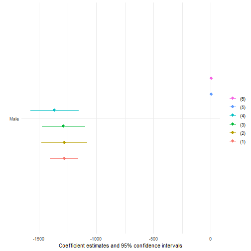

```r
# Fit regression(s)

# Regression diagnostics (esp. visual)


#https://www.datanovia.com/en/blog/how-to-plot-a-smooth-line-using-ggplot2/


summary(suicide_final)
```

```
##     iso3c             country               year          sex                gdp_pc            edu              sui         
##  Length:5490        Length:5490        Min.   :2012   Length:5490        Min.   :   261   Min.   : 5.000   Min.   :  0.000  
##  Class1:labelled    Class1:labelled    1st Qu.:2014   Class1:labelled    1st Qu.:  1670   1st Qu.: 8.000   1st Qu.:  3.700  
##  Class2:character   Class2:character   Median :2016   Class2:character   Median :  5267   Median : 9.000   Median :  6.900  
##  Mode  :character   Mode  :character   Mean   :2016   Mode  :character   Mean   : 12701   Mean   : 9.663   Mean   :  9.942  
##                                        3rd Qu.:2019                      3rd Qu.: 15126   3rd Qu.:11.000   3rd Qu.: 12.200  
##                                        Max.   :2021                      Max.   :108351   Max.   :17.000   Max.   :147.800  
##      unem_y           unem_t           pop_t                alc               drug             depr            sh         
##  Min.   : 0.194   Min.   : 0.050   Min.   :8.767e+04   Min.   :  62.41   Min.   : 74.78   Min.   :1118   Min.   :  7.218  
##  1st Qu.: 8.080   1st Qu.: 3.703   1st Qu.:2.664e+06   1st Qu.: 315.08   1st Qu.:152.03   1st Qu.:3078   1st Qu.: 24.766  
##  Median :14.225   Median : 5.904   Median :9.482e+06   Median : 658.09   Median :192.72   Median :3836   Median : 38.268  
##  Mean   :17.733   Mean   : 8.020   Mean   :4.090e+07   Mean   : 749.94   Mean   :203.65   Mean   :3972   Mean   : 52.959  
##  3rd Qu.:24.255   3rd Qu.:10.514   3rd Qu.:3.004e+07   3rd Qu.:1081.77   3rd Qu.:237.72   3rd Qu.:4831   3rd Qu.: 74.908  
##  Max.   :80.762   Max.   :37.901   Max.   :1.412e+09   Max.   :3678.89   Max.   :600.03   Max.   :9268   Max.   :280.768  
##   continent            region              year1                deaths         
##  Length:5490        Length:5490        Min.   :2012-01-01   Min.   :0.000e+00  
##  Class1:labelled    Class1:labelled    1st Qu.:2014-01-01   1st Qu.:9.905e+06  
##  Class2:character   Class2:character   Median :2016-07-02   Median :3.958e+07  
##  Mode  :character   Mode  :character   Mean   :2016-07-02   Mean   :2.582e+08  
##                                        3rd Qu.:2019-01-01   3rd Qu.:1.376e+08  
##                                        Max.   :2021-01-01   Max.   :1.823e+10
```

```r
library(fixest)
library(modelsummary)
library(stats)

library(sjPlot)
library(sjlabelled)
```

```
## 
## Attaching package: 'sjlabelled'
```

```
## The following object is masked from 'package:expss':
## 
##     read_spss
```

```
## The following object is masked from 'package:forcats':
## 
##     as_factor
```

```
## The following object is masked from 'package:ggplot2':
## 
##     as_label
```

```
## The following object is masked from 'package:dplyr':
## 
##     as_label
```

```r
library(sjmisc)
```

```
## 
## Attaching package: 'sjmisc'
```

```
## The following object is masked from 'package:naniar':
## 
##     all_na
```

```
## The following objects are masked from 'package:expss':
## 
##     add_columns, add_rows, rec
```

```
## The following object is masked from 'package:maditr':
## 
##     to_long
```

```
## The following object is masked from 'package:purrr':
## 
##     is_empty
```

```
## The following object is masked from 'package:tibble':
## 
##     add_case
```

```
## The following object is masked from 'package:tidyr':
## 
##     replace_na
```

```r
library(ggplot2)
```

Does the suicide rate increase over time for males or females?


```r
# Simplest model
reg1 <- suicide_final %>% filter(sex != "Both") %>% feols(sui ~ sex + year + sex*year)

# Fixed effect by country
reg2 <- suicide_final %>% filter(sex != "Both") %>% feols(sui ~ sex + year + sex*year | country)

# Including economic data
reg3 <- suicide_final %>% filter(sex != "Both") %>% feols(sui ~ sex + year + sex*year + pop_t + 
                                                            edu + gdp_pc + unem_y + unem_t | country)
# Including mental health data
reg4 <- suicide_final %>% filter(sex != "Both") %>% feols(sui ~ sex + year + sex*year + pop_t 
                                                          + edu + gdp_pc + unem_y + unem_t+ 
                                                            alc + drug + depr + sh | country)
# 4 plus fixed effect for year
reg5 <- suicide_final %>% filter(sex != "Both") %>% feols(sui ~ sex + pop_t 
                                                          + edu + gdp_pc + unem_y + unem_t+ 
                                                            alc + drug + depr + sh | country + year,
                                                          cluster = ~ country)
# 5 minus vars with zero coefficient
reg6 <- suicide_final %>% filter(sex != "Both") %>% feols(sui ~ sex + 
                                                          edu + unem_y + unem_t+ 
                                                            alc + drug + depr + sh | country + year,
                                                          cluster = ~ country)
```

Overview of models


```r
models <- list(reg1, reg2, reg3, reg4, reg5, reg6)

coefs = c("sexMale" = "Male", "year" = "Year", "sexMale year" = "Male * Year", "pop_t" = "Total population", "edu" = "Years compulsory education", "gdp_pc" = "GDP per capita", "unem_y" = "Youth unemployment", "unem_t" = "Total unemployment", "alc" = "Alcohol misuse", "drug" = "Drug misuse", "sh" = "Self harm")

model_summary <- modelsummary(models,
                              coef_omit = "Intercept",
                              coef_map = coefs,
                              stars = TRUE)
```

Showing the coefficients and standard errors for the 5 models


```r
model_plot <- modelplot(models,
                        coef_map = c("sexMale" = "Male")) +
  guides(color = guide_legend(reverse = TRUE))

model_summary
```

<table style="NAborder-bottom: 0; width: auto !important; margin-left: auto; margin-right: auto;" class="table">
 <thead>
  <tr>
   <th style="text-align:left;">   </th>
   <th style="text-align:center;">  (1) </th>
   <th style="text-align:center;">   (2) </th>
   <th style="text-align:center;">   (3) </th>
   <th style="text-align:center;">   (4) </th>
   <th style="text-align:center;">   (5) </th>
   <th style="text-align:center;">   (6) </th>
  </tr>
 </thead>
<tbody>
  <tr>
   <td style="text-align:left;"> Male </td>
   <td style="text-align:center;"> 290.420 </td>
   <td style="text-align:center;"> 290.420*** </td>
   <td style="text-align:center;"> 336.274*** </td>
   <td style="text-align:center;"> 441.885*** </td>
   <td style="text-align:center;"> 10.947*** </td>
   <td style="text-align:center;"> 10.952*** </td>
  </tr>
  <tr>
   <td style="text-align:left;">  </td>
   <td style="text-align:center;"> (243.925) </td>
   <td style="text-align:center;"> (63.452) </td>
   <td style="text-align:center;"> (81.386) </td>
   <td style="text-align:center;"> (106.195) </td>
   <td style="text-align:center;"> (0.772) </td>
   <td style="text-align:center;"> (0.774) </td>
  </tr>
  <tr>
   <td style="text-align:left;"> Year </td>
   <td style="text-align:center;"> −0.079 </td>
   <td style="text-align:center;"> −0.079*** </td>
   <td style="text-align:center;"> −0.049* </td>
   <td style="text-align:center;"> −0.029 </td>
   <td style="text-align:center;">  </td>
   <td style="text-align:center;">  </td>
  </tr>
  <tr>
   <td style="text-align:left;">  </td>
   <td style="text-align:center;"> (0.086) </td>
   <td style="text-align:center;"> (0.014) </td>
   <td style="text-align:center;"> (0.023) </td>
   <td style="text-align:center;"> (0.026) </td>
   <td style="text-align:center;">  </td>
   <td style="text-align:center;">  </td>
  </tr>
  <tr>
   <td style="text-align:left;"> Total population </td>
   <td style="text-align:center;">  </td>
   <td style="text-align:center;">  </td>
   <td style="text-align:center;"> 0.000 </td>
   <td style="text-align:center;"> 0.000 </td>
   <td style="text-align:center;"> 0.000 </td>
   <td style="text-align:center;">  </td>
  </tr>
  <tr>
   <td style="text-align:left;">  </td>
   <td style="text-align:center;">  </td>
   <td style="text-align:center;">  </td>
   <td style="text-align:center;"> (0.000) </td>
   <td style="text-align:center;"> (0.000) </td>
   <td style="text-align:center;"> (0.000) </td>
   <td style="text-align:center;">  </td>
  </tr>
  <tr>
   <td style="text-align:left;"> Years compulsory education </td>
   <td style="text-align:center;">  </td>
   <td style="text-align:center;">  </td>
   <td style="text-align:center;"> −0.058 </td>
   <td style="text-align:center;"> −0.058 </td>
   <td style="text-align:center;"> −0.046 </td>
   <td style="text-align:center;"> −0.049 </td>
  </tr>
  <tr>
   <td style="text-align:left;">  </td>
   <td style="text-align:center;">  </td>
   <td style="text-align:center;">  </td>
   <td style="text-align:center;"> (0.078) </td>
   <td style="text-align:center;"> (0.082) </td>
   <td style="text-align:center;"> (0.085) </td>
   <td style="text-align:center;"> (0.085) </td>
  </tr>
  <tr>
   <td style="text-align:left;"> GDP per capita </td>
   <td style="text-align:center;">  </td>
   <td style="text-align:center;">  </td>
   <td style="text-align:center;"> 0.000 </td>
   <td style="text-align:center;"> 0.000 </td>
   <td style="text-align:center;"> 0.000 </td>
   <td style="text-align:center;">  </td>
  </tr>
  <tr>
   <td style="text-align:left;">  </td>
   <td style="text-align:center;">  </td>
   <td style="text-align:center;">  </td>
   <td style="text-align:center;"> (0.000) </td>
   <td style="text-align:center;"> (0.000) </td>
   <td style="text-align:center;"> (0.000) </td>
   <td style="text-align:center;">  </td>
  </tr>
  <tr>
   <td style="text-align:left;"> Youth unemployment </td>
   <td style="text-align:center;">  </td>
   <td style="text-align:center;">  </td>
   <td style="text-align:center;"> −0.274 </td>
   <td style="text-align:center;"> −0.245 </td>
   <td style="text-align:center;"> −0.240 </td>
   <td style="text-align:center;"> −0.239 </td>
  </tr>
  <tr>
   <td style="text-align:left;">  </td>
   <td style="text-align:center;">  </td>
   <td style="text-align:center;">  </td>
   <td style="text-align:center;"> (0.186) </td>
   <td style="text-align:center;"> (0.176) </td>
   <td style="text-align:center;"> (0.176) </td>
   <td style="text-align:center;"> (0.175) </td>
  </tr>
  <tr>
   <td style="text-align:left;"> Total unemployment </td>
   <td style="text-align:center;">  </td>
   <td style="text-align:center;">  </td>
   <td style="text-align:center;"> 0.756** </td>
   <td style="text-align:center;"> 0.650* </td>
   <td style="text-align:center;"> 0.640* </td>
   <td style="text-align:center;"> 0.639* </td>
  </tr>
  <tr>
   <td style="text-align:left;">  </td>
   <td style="text-align:center;">  </td>
   <td style="text-align:center;">  </td>
   <td style="text-align:center;"> (0.285) </td>
   <td style="text-align:center;"> (0.261) </td>
   <td style="text-align:center;"> (0.260) </td>
   <td style="text-align:center;"> (0.260) </td>
  </tr>
  <tr>
   <td style="text-align:left;"> Alcohol misuse </td>
   <td style="text-align:center;">  </td>
   <td style="text-align:center;">  </td>
   <td style="text-align:center;">  </td>
   <td style="text-align:center;"> 0.001 </td>
   <td style="text-align:center;"> 0.001 </td>
   <td style="text-align:center;"> 0.001 </td>
  </tr>
  <tr>
   <td style="text-align:left;">  </td>
   <td style="text-align:center;">  </td>
   <td style="text-align:center;">  </td>
   <td style="text-align:center;">  </td>
   <td style="text-align:center;"> (0.001) </td>
   <td style="text-align:center;"> (0.001) </td>
   <td style="text-align:center;"> (0.001) </td>
  </tr>
  <tr>
   <td style="text-align:left;"> Drug misuse </td>
   <td style="text-align:center;">  </td>
   <td style="text-align:center;">  </td>
   <td style="text-align:center;">  </td>
   <td style="text-align:center;"> 0.012 </td>
   <td style="text-align:center;"> 0.010 </td>
   <td style="text-align:center;"> 0.010 </td>
  </tr>
  <tr>
   <td style="text-align:left;">  </td>
   <td style="text-align:center;">  </td>
   <td style="text-align:center;">  </td>
   <td style="text-align:center;">  </td>
   <td style="text-align:center;"> (0.013) </td>
   <td style="text-align:center;"> (0.013) </td>
   <td style="text-align:center;"> (0.013) </td>
  </tr>
  <tr>
   <td style="text-align:left;"> Self harm </td>
   <td style="text-align:center;">  </td>
   <td style="text-align:center;">  </td>
   <td style="text-align:center;">  </td>
   <td style="text-align:center;"> 0.204*** </td>
   <td style="text-align:center;"> 0.205*** </td>
   <td style="text-align:center;"> 0.205*** </td>
  </tr>
  <tr>
   <td style="text-align:left;box-shadow: 0px 1px">  </td>
   <td style="text-align:center;box-shadow: 0px 1px">  </td>
   <td style="text-align:center;box-shadow: 0px 1px">  </td>
   <td style="text-align:center;box-shadow: 0px 1px">  </td>
   <td style="text-align:center;box-shadow: 0px 1px"> (0.036) </td>
   <td style="text-align:center;box-shadow: 0px 1px"> (0.036) </td>
   <td style="text-align:center;box-shadow: 0px 1px"> (0.036) </td>
  </tr>
  <tr>
   <td style="text-align:left;"> Num.Obs. </td>
   <td style="text-align:center;"> 3660 </td>
   <td style="text-align:center;"> 3660 </td>
   <td style="text-align:center;"> 3660 </td>
   <td style="text-align:center;"> 3660 </td>
   <td style="text-align:center;"> 3660 </td>
   <td style="text-align:center;"> 3660 </td>
  </tr>
  <tr>
   <td style="text-align:left;"> R2 </td>
   <td style="text-align:center;"> 0.209 </td>
   <td style="text-align:center;"> 0.763 </td>
   <td style="text-align:center;"> 0.771 </td>
   <td style="text-align:center;"> 0.789 </td>
   <td style="text-align:center;"> 0.789 </td>
   <td style="text-align:center;"> 0.789 </td>
  </tr>
  <tr>
   <td style="text-align:left;"> R2 Adj. </td>
   <td style="text-align:center;"> 0.208 </td>
   <td style="text-align:center;"> 0.751 </td>
   <td style="text-align:center;"> 0.758 </td>
   <td style="text-align:center;"> 0.778 </td>
   <td style="text-align:center;"> 0.777 </td>
   <td style="text-align:center;"> 0.777 </td>
  </tr>
  <tr>
   <td style="text-align:left;"> R2 Within </td>
   <td style="text-align:center;">  </td>
   <td style="text-align:center;"> 0.469 </td>
   <td style="text-align:center;"> 0.486 </td>
   <td style="text-align:center;"> 0.527 </td>
   <td style="text-align:center;"> 0.524 </td>
   <td style="text-align:center;"> 0.524 </td>
  </tr>
  <tr>
   <td style="text-align:left;"> R2 Within Adj. </td>
   <td style="text-align:center;">  </td>
   <td style="text-align:center;"> 0.469 </td>
   <td style="text-align:center;"> 0.485 </td>
   <td style="text-align:center;"> 0.525 </td>
   <td style="text-align:center;"> 0.523 </td>
   <td style="text-align:center;"> 0.523 </td>
  </tr>
  <tr>
   <td style="text-align:left;"> AIC </td>
   <td style="text-align:center;"> 27609.5 </td>
   <td style="text-align:center;"> 23554.6 </td>
   <td style="text-align:center;"> 23446.8 </td>
   <td style="text-align:center;"> 23148.2 </td>
   <td style="text-align:center;"> 23172.1 </td>
   <td style="text-align:center;"> 23168.9 </td>
  </tr>
  <tr>
   <td style="text-align:left;"> BIC </td>
   <td style="text-align:center;"> 27634.4 </td>
   <td style="text-align:center;"> 24708.7 </td>
   <td style="text-align:center;"> 24632.0 </td>
   <td style="text-align:center;"> 24358.2 </td>
   <td style="text-align:center;"> 24425.6 </td>
   <td style="text-align:center;"> 24410.0 </td>
  </tr>
  <tr>
   <td style="text-align:left;"> RMSE </td>
   <td style="text-align:center;"> 10.50 </td>
   <td style="text-align:center;"> 5.74 </td>
   <td style="text-align:center;"> 5.65 </td>
   <td style="text-align:center;"> 5.42 </td>
   <td style="text-align:center;"> 5.43 </td>
   <td style="text-align:center;"> 5.43 </td>
  </tr>
  <tr>
   <td style="text-align:left;"> Std.Errors </td>
   <td style="text-align:center;"> IID </td>
   <td style="text-align:center;"> by: country </td>
   <td style="text-align:center;"> by: country </td>
   <td style="text-align:center;"> by: country </td>
   <td style="text-align:center;"> by: country </td>
   <td style="text-align:center;"> by: country </td>
  </tr>
  <tr>
   <td style="text-align:left;"> FE: country </td>
   <td style="text-align:center;">  </td>
   <td style="text-align:center;"> X </td>
   <td style="text-align:center;"> X </td>
   <td style="text-align:center;"> X </td>
   <td style="text-align:center;"> X </td>
   <td style="text-align:center;"> X </td>
  </tr>
  <tr>
   <td style="text-align:left;"> FE: year </td>
   <td style="text-align:center;">  </td>
   <td style="text-align:center;">  </td>
   <td style="text-align:center;">  </td>
   <td style="text-align:center;">  </td>
   <td style="text-align:center;"> X </td>
   <td style="text-align:center;"> X </td>
  </tr>
</tbody>
<tfoot><tr><td style="padding: 0; " colspan="100%">
<sup></sup> + p &lt; 0.1, * p &lt; 0.05, ** p &lt; 0.01, *** p &lt; 0.001</td></tr></tfoot>
</table>


```r
model_plot
```




